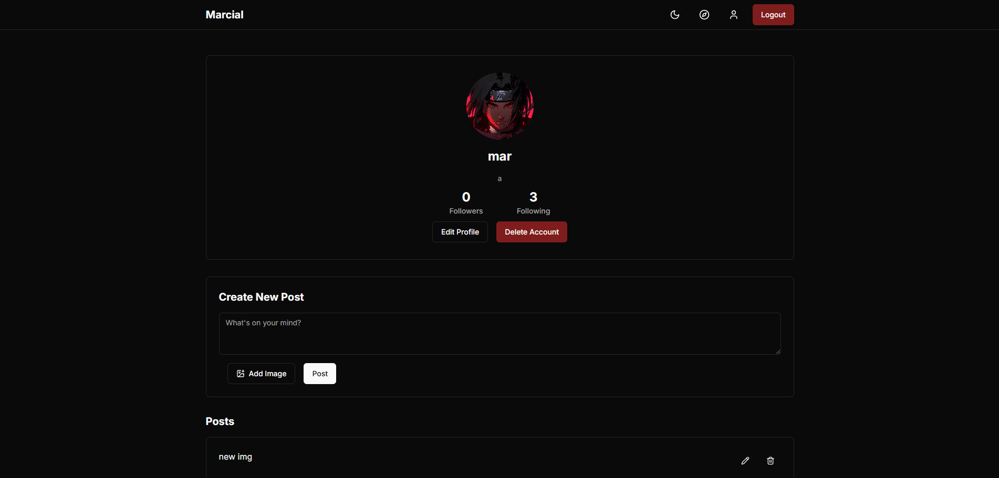

# Social Network App

## Overview
This is a social networking application built with Next.js, React, Tailwind CSS, and Zustand for state management. The project includes various features such as user authentication, profile management, posting functionality, and a recommendation system implemented using graph data structures.

## Features

### Authentication
- User login and signup functionality.

### Explore Page
- **Suggested Users**: Users are recommended using a graph-based suggestion system implemented with a matrix.
- **Following**: Displays the list of users the logged-in user follows.

### Profile Page
- **User Information**: Displays avatar, username, and name.
- **Edit Profile**: Users can change their avatar and name.
- **Followings & Followers**: Users can see lists of people they follow and their followers.
- **Post Creation**: Allows users to select an image, add a message, and post it.
- **Posts Section**: Users can create, edit, and delete their posts.
- **Delete Account**: Users can delete their account.

### Viewing Other Users
- Clicking on a followed user navigates to their profile.
- Displays their avatar, name, username, followers, followings, and posts.

### Dark and Light Theme
- Users can toggle between dark and light mode.

## Tech Stack
- **Frontend:** Next.js, React, Tailwind CSS
- **State Management:** Zustand
- **Data Structure:** Graph implementation using a matrix

## Installation & Setup
1. Clone the repository:
   ```sh
   git clone https://github.com/your-repo/social-network-app.git
   ```
2. Navigate to the project directory:
   ```sh
   cd social-network-app
   ```
3. Install dependencies:
   ```sh
   npm install
   ```
4. Start the development server:
   ```sh
   npm run dev
   ```
5. Open [http://localhost:3000](http://localhost:3000) in your browser.

## Deployment
The project is deployed on **Vercel**. You can access it here:
[Live Demo](https://react-music-player-steel.vercel.app/)

## Screenshot
### login

### explore

### userprofile account information

### userprofile followings

### userprofile posts

### other users profile


---
## Author
[MaryamDar](https://github.com/marydar)

